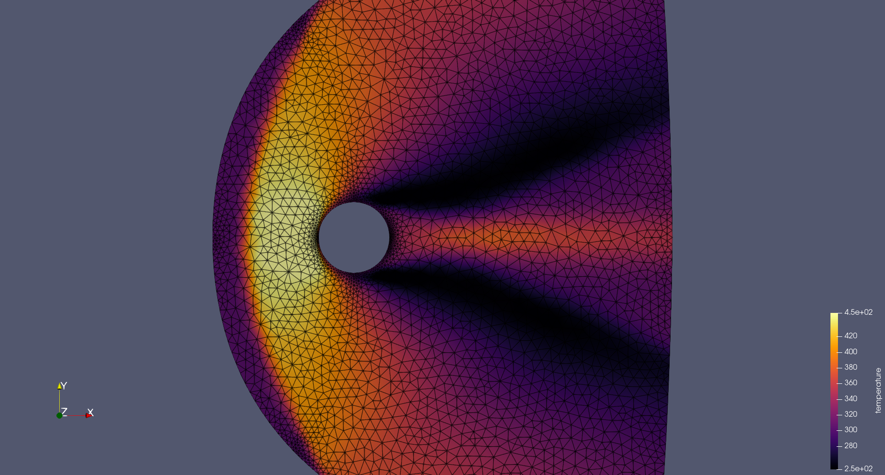

# SLOW
Supersonic flow simulation code with low-learning cost


# Code description

`SLOW` solves compressible Navier-Stoke equations for unstructure mesh by a python script.


# How to start calculation

## Simulation

```console
python3 src/slow.py
```

Tutorial case: `testcase/`


## Configuration file

Numerical simulation by `SLOW` is controled by the configuration file: `config.yml`.

## Example



## Requirements

`SLOW` requires the following packages:
- python (version >= 3.6.9)
- numpy (vesrsion >= 1.19.5)
- yaml (version >= 3.12)
- gmsh (version >= 4.9.5)


# Contact:

Yusuke Takahashi, Hokkaido University

ytakahashi@eng.hokudai.ac.jp


# References
