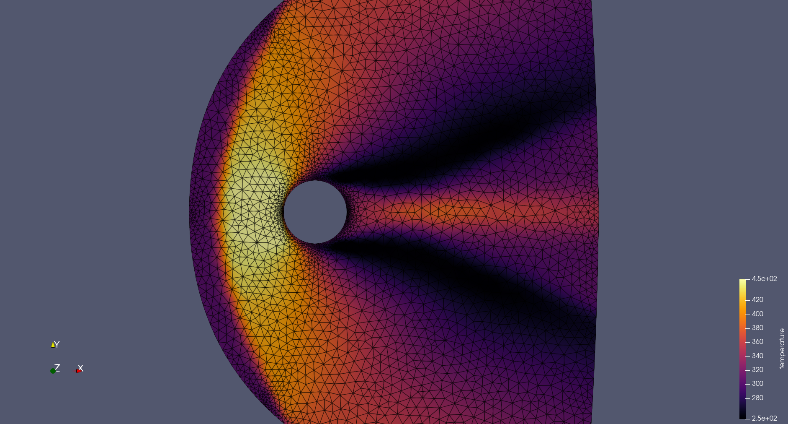

# SLOW
Supersonic flow simulation code with low-learning cost


# Code description

`SLOW` solves compressible Navier-Stokes equations for unstructured mesh by a python script.

Note: the current implementation is **two-dimensional**. Three-dimensional support is not
completed yet (`meshdata.py` stops with a message for a 3D mesh).


# Installation

```console
python3 -m venv .venv
source .venv/bin/activate
pip install -e .
```

Development (test) dependencies:

```console
pip install -r requirements-dev.txt
```

Runtime dependencies alone are listed in `requirements.txt`.


# How to start calculation

## Simulation

After `pip install -e .`:

```console
slow
```

Without installing, `src/` only needs to be on the module search path:

```console
PYTHONPATH=src python3 -m slow
```

Tutorial cases live in `tutorial/`. Each of them has a `run_slow.sh` that works either way:

```console
cd tutorial/work_nozzle_prism
./run_slow.sh
```


## Configuration file

Numerical simulation by `SLOW` is controlled by the configuration file: `config.yml`.
A reference copy with every key documented is `src/config.yml`.
Another file name can be given by `-file`:

```console
slow -file my_config.yml
```


# Tests

```console
pytest
```

- `tests/test_flux_jacobian.py` LU-SGS の流束ヤコビアンを厳密な微分と突き合わせる
- `tests/test_eigenvalue.py` LU-SGS が用いる最大固有値の定義を固定する
- `tests/test_roe_dissipation.py` 行列散逸 `|A_Roe|=P|Lambda|P^-1` を検証する
- `tests/test_lusgs_options.py` LU-SGS の設定（散逸の種類・時間項）と時間刻みのガードを固定する
- `tests/test_lusgs_sweep.py` LU-SGS のスイープを、密行列に組み直した `D`, `L`, `U` と突き合わせる
- `tests/test_gradient_boundary.py` Green-Gauss の境界寄与を線形場の厳密再現で検証する
- `tests/test_convergence_check.py` 内側・外側ループの収束判定を固定する
- `tests/test_rhs_snapshot.py` メッシュ読み込みから残差までを通し、基準値との一致を確認する

`tests/test_rhs_snapshot.py` は残差の値を意図的に変えたときだけ基準値を作り直す
（手順はファイル先頭のコメントを参照）。

数値部分の検証に使っている方法は [docs/verification.md](docs/verification.md) にまとめてある。
複素ステップ微分による解析的恒等式、陰解演算子を密行列に組み直しての突き合わせ、
時間精度の次数測定、前後のビット比較など。新しい数値を入れるとき、あるいは
「挙動は変えていない」と主張するときは、そこに書いてある型のどれかで裏を取る。


## Example




## Implicit operator (LU-SGS)

Time integration by `implicit_lusgs` builds its implicit operator as
`D + L + U` with `D` on the cell and `L`, `U` from the faces. The dissipation
used for the off-diagonal part is selected by `kind_lusgs_dissipation`:

| | `scalar` (default) | `matrix` |
|---|---|---|
| 散逸の型 | スカラー（局所 Lax--Friedrichs 型） | 行列（Roe 型） |
| 非対角項 | `0.5*(A - lambda*I)*S` | `0.5*(A - \|A_Roe\|)*S` |
| `lambda` / `\|A_Roe\|` | `max(lambda_a, lambda_b)` | `P\|Lambda\|P^-1`（Roe 平均） |
| 対角 `D` | セルごとのスカラー | セルごとの 5x5 ブロック |

`matrix` は内部反復あたりのコストが `scalar` の約 1.6 倍だが、内部反復の減衰が
ノズル格子（7734 要素, CFL 2.5）で 1.4--3.3 倍速くなるため差し引きで有利になる。
陰解演算子が違っても収束後の解は一致する。項目を省略した場合は `scalar` になる。


## Performance

面ループ・セルループは `*_kernel.py` に切り出してあり、`numba` が入っていれば
コンパイルされる。`numba` は**任意依存**で、無くても動く（遅いだけ）。

```console
pip install -e ".[fast]"      # numba を入れる
SLOW_DISABLE_NUMBA=1 slow     # 明示的に切る（デバッグ時）
```

実測（ノズル格子 7,325 セル）: 内側反復 1 回が 1,254 ms --> 4.9 ms、
外側 5 反復の実行全体で 166.8 秒 --> 2.4 秒。結果は変わらない（差は 1e-15 程度）。
内訳と方針は [docs/performance.md](docs/performance.md) を参照。


## Requirements

- python (version >= 3.9)
- numpy (version >= 1.22)
- pyyaml (version >= 6.0)
- gmsh (version >= 4.9.5)

Optional:

- numba (version >= 0.59) 面ループ・セルループのコンパイルに使う


# Contact:

Yusuke Takahashi, Hokkaido University

ytakahashi@eng.hokudai.ac.jp


# References
